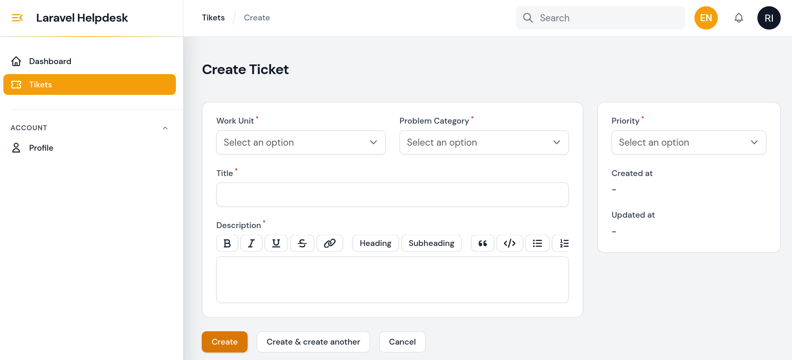
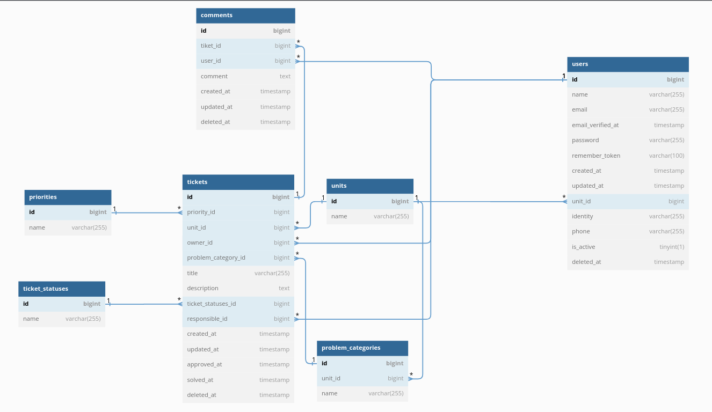
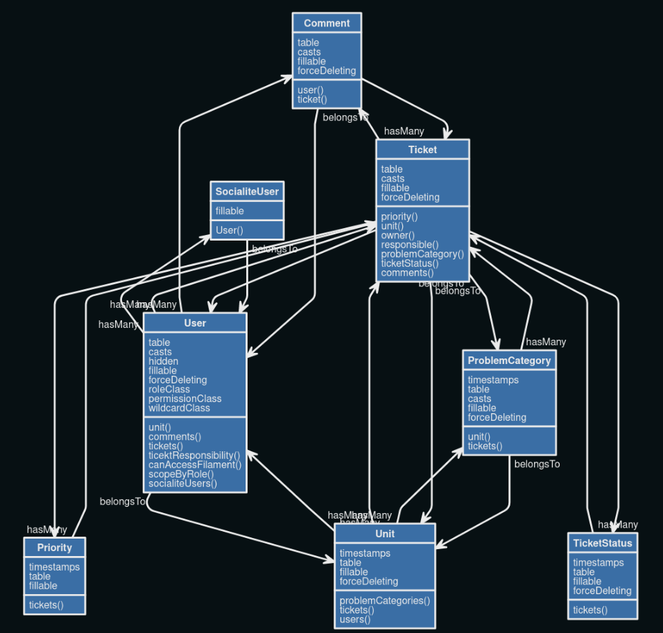
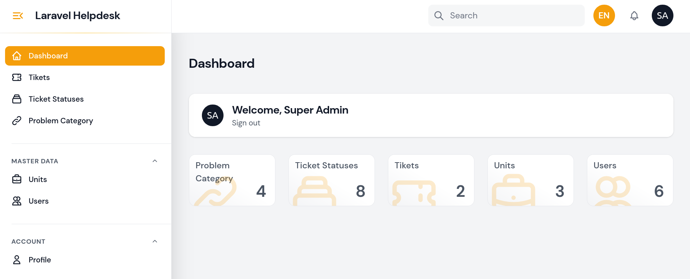

Helpdesk Laravel

Helpdesk Laravel is a web-based ticketing and helpdesk portal built with the Laravel Framework v12 and Filament v3. The system is designed to help organizations manage support requests, assign tickets to responsible staff, track ticket progress, maintain conversations, and monitor support activity from a centralized administration panel.

The application provides role-based access, unit-based ticket visibility, ticket categorization and prioritization, status tracking, comments, notifications, activity logs, and dashboard reporting.

Key Features

Ticket Submission: Users can create support tickets with a work unit, category, client name, description, and priority.

Ticket Management: Authorized users can view, create, edit, assign, delete, restore, and manage tickets according to their roles and permissions.

Ticket Assignment: Admin users can assign tickets to a responsible support user directly from the ticket list or ticket form.

Ticket Prioritization: Tickets can be assigned priorities to indicate urgency and help support teams organize their workload.

Ticket Status Management: Administrators can configure ticket statuses and update the status of tickets throughout their lifecycle.

Role-Based Access Control: Different roles and permissions control access to tickets, users, units, categories, statuses, and settings.

Unit-Based Access: Tickets can be associated with work units, with visibility controlled according to the user's role and assigned unit.

My Tickets: Support users can quickly filter and view tickets assigned to them.

Comments & Conversations: Users can add comments to tickets to maintain ongoing communication and troubleshooting history.

Activity Tracking: Ticket activities are logged to provide a history of important actions for tracking and auditing.

Email Notifications: Users can receive notifications for ticket creation, comments, status changes, deletion, and restoration.

Dashboard Reporting: The dashboard provides ticket status statistics and a visual chart to monitor the overall support workload.

Search, Filtering & Sorting: Tickets can be searched, filtered by owner/status, and sorted for easier ticket management.

Soft Delete & Restore: Tickets and other supported resources can be soft-deleted, restored, or permanently deleted when authorized.

User Management: Administrators can manage users, roles, units, account status, and related tickets.

Category & Unit Management: Support categories can be associated with work units for organized ticket classification.

Configurable Ticket Settings: Administrators can configure the default ticket priority and define which statuses represent closed tickets.

Profile & Account Management: Users can manage their profile and browser sessions through the administration panel.

Database Notifications: Filament database notifications are integrated into the admin panel for in-application alerts.

Technology Stack

Backend: PHP, Laravel 12

Admin Panel: Filament 3

Database: MySQL / compatible relational database

Frontend: Blade, Filament UI

Authentication: Laravel authentication and session management

Authorization: Spatie Roles & Permissions

Charts: Filament Apex Charts / ApexCharts

****Activity Logging: Activity Log

Notifications: Laravel Notifications with email and Filament database notifications

API Authentication: Laravel Sanctum

Development Tools: Composer, Git, Laravel Debugbar, PHPStan/Larastan, PHPUnit

Database Design

Unified Modeling Language (UML)

🛠️ Technology Stack

Technology

Usage

Laravel 12

Backend application framework

Filament 3

Admin panel and resource management

PHP

Application development

MySQL

Relational database

Spatie Permissions

Role and permission management

ApexCharts

Dashboard charts and statistics

Activity Log

Tracking system and user activities

Blade

Server-side application views

Requirements

PHP 8.2 or higher

Composer

Database (e.g. MySQL, PostgreSQL, SQLite)

Web Server (e.g. Apache, Nginx, IIS)

Node.js and npm (for frontend asset development, if required)

Installation

Install Composer

Clone the repository:
git clone https://github.com/ruswan/laravel_helpdesk.git

Enter the project directory:
cd laravel_helpdesk

Install PHP dependencies:
composer install

Setup configuration:
cp .env.example .env

Generate the application key:
php artisan key:generate

Create a database and update the database configuration in .env.

Run database migrations:
php artisan migrate

Run database seeders:
php artisan db:seed

Create the storage symlink:
php artisan storage:link

Run the development server:
php artisan serve

Dummy Accounts

Super Admin

Email: superadmin@example.com

Password: password

Admin Unit

Email: adminunit@example.com

Password: password

Staff Unit

Email: staffunit@example.com

Password: password

General User

Email: user@example.com

Password: password

Super Admin Preview

Project Structure

The main application areas include:

app/Filament/Resources/ — Ticket, user, category, unit, and ticket-status management resources.

app/Filament/Pages/ — Dashboard and configurable application settings.

app/Filament/Widgets/ — Ticket status statistics and charts.

app/Models/ — Ticket, user, category, unit, status, priority, and comment models.

app/Notifications/ — Ticket and comment notification classes.

app/Observers/ — Ticket and comment event handling and notification triggers.

app/Policies/ — Authorization policies for application resources.

License

This project is provided for development and learning purposes. See the repository license for details.
